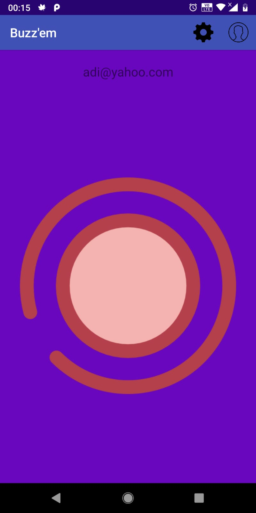

PriceAnalyzer
=============

Android application for alerting your friends when you need their attention.

## How does it work?

As a user, you have multiple contacts (i.e. other users who have the application installed) and you "BUZZ" them (i.e. notify them). The notification consists of turning on and off the camera flash, flashing the screen, playing a song and turning on the vibrations.

## UX

The user needs to have an account in order to use the application.

For signing up, the user needs to provide a valid email and a password.

After that a confirmation email is sent to the given address.

Until the confirmation is made the user will not be able to use his account.

After logging in, the user's friends will be listed.

The email and previous number of "buzzez" are shown for each user .

When tapping on an user, a "BUZZ" button will be prompted.

Just tap the big "BUZZ" button and the other contact will immediately know that his attention is needed.

For adding new contacts just tap the "PLUS" icon in the top right corner of the main menu, write an email in the search bar and press return. All emails that match will be shown. The contacts will be added by tapping on them.

## Technologies used
- Android
- Kotlin
- Firebase
